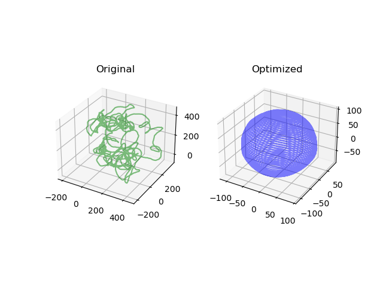

# 位姿图优化

## 1 依赖

1. Ceres >= 2.0

ceres 的下载和安装可以使用国内镜像以避免科学上网带来的麻烦

```bash
git clone https://gitee.com/mirrors/ceres-solver.git
```

剩下的按照官网的安装指引操作即可http://ceres-solver.org/installation.html

另外一点，在CMakeLists中务必开启编译器优化，不然运行速度会变慢:

```cmake
SET( CMAKE_CXX_FLAGS "-O3" )
```


## 2 运行

这是一个不依赖于ROS的程序，编译运行即可：

```bash
git clone https://github.com/mengkai98/ieskf_slam.git -b pose_graph pose_graph
cd pose_graph
mkdir build 
cd build
cmake ..
make 
./pose_graph_3d
```

众所周知，这个是基于官方的例程，所以为了能够显示优化后的结果，我把绘图的脚本也拉取了过来，运行完成后会在根目录生成`init_pose.txt`和`opt_pose.txt`表示初始位姿和优化后的位姿。如下操作即可：

```bash
cd pose_graph
./plot_results.py --initial_poses init_pose.txt --optimized_poses opt_pose.txt
```

